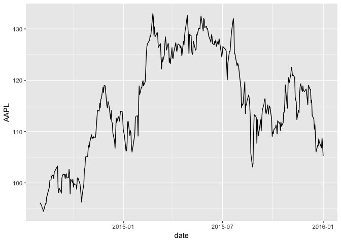
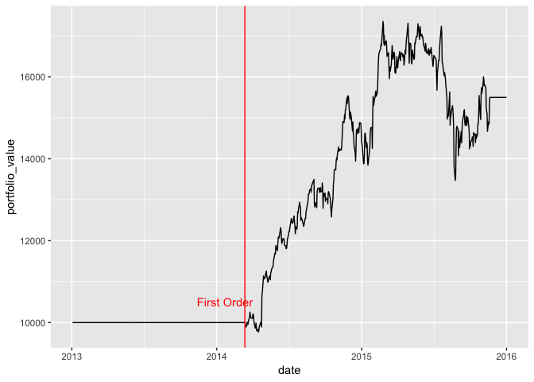

<!-- README.md is generated from README.Rmd. Please edit that file -->


# flyingfox

The goal of `flyingfox` is to connect Quantopian’s `zipline` financial
backtesting package with R.

## Installation

You can install the released version of flyingfox from
[CRAN](https://CRAN.R-project.org) with:

``` r
# NO YOU CANNOT
install.packages("flyingfox")
```

And the development version from [GitHub](https://github.com/) with:

``` r
# install.packages("devtools")
devtools::install_github("DavisVaughan/flyingfox")
```

## Setup

(Using reticulate \>= 1.7.1)

To get started with `zipline`, you’ll need the `zipline` Python module.
Install it with:

``` r
install_zipline()
```

By default `zipline` will be installed into the virtualenv,
`r-reticulate`, as recommended by `reticulate`.

Next, you’ll need data to run the backtest on. The easiest way to do
this is to:

1)  Create a free account on [Quandl](https://www.quandl.com/) and find
    your API Key in Account Settings.

2)  Add the API key as the R environment variable, `QUANDL_API_KEY`
    (access your `.Renviron` file with `usethis::edit_r_environ()`).

3)  “Ingest” the Quandl data with `flyingfox::fly_ingest()`.

<!-- end list -->

``` r
fly_ingest()
```

## Example

`flyingfox` backtests are run using a combination of two main functions.
`fly_initialize()` sets up variables you might need during the backtest
along with giving you a chance to schedule functions to run
periodically. `fly_handle_data()` is called at a daily/minutely
frequency and runs your algorithm, orders assets, and records data for
future inspection.

Below, we are going to create a basic mean reversion strategy to
demonstrate the basics of running an algorithm.

``` r
library(flyingfox)
```

First, set up an initialize function. It must take `context` as the
argument. Think of `context` as a persistent environment where you can
store variables and assets that you want to access at any point in the
simulation.

``` r
fly_initialize <- function(context) {

  # We want to track what day we are on. The mean reversion algo we use
  # should have at least 300 days of data before doing anything
  context$i = 0L

  # We want to trade apple stock
  context$asset = fly_symbol("AAPL")
}
```

Next, create a data handling function that accepts `context` and `data`.
Think of `data` as an environment containing functions for accessing
historical and current price data about the assets you are using in your
simulation.

The below implementation of `fly_handle_data()` demonstrates a mean
reversion algorithm.

``` r
fly_handle_data <- function(context, data) {

  # Increment day
  context$i <- context$i + 1L

  # While < 300 days of data, return
  if(context$i < 300L) {
    return()
  }

  # Calculate a short term (100 day) moving average
  # by pulling history for the asset (apple) and taking an average
  short_hist <- fly_data_history(data, context$asset, "price", bar_count = 100L, frequency = "1d")
  short_mavg <- mean(short_hist)

  # Calculate a long term (300 day) moving average
  long_hist <- fly_data_history(data, context$asset, "price", bar_count = 300L, frequency = "1d")
  long_mavg <- mean(long_hist)

  # If short > long, go 100% in apple
  if(short_mavg > long_mavg) {
    fly_order_target_percent(asset = context$asset, target = 1)
  }
  # Else if we hit the crossover, dump all of apple
  else if (short_mavg < long_mavg) {
    fly_order_target_percent(asset = context$asset, target = 0)
  }

  # Record today's data
  # We record the current apple price, along with the value of the short and long
  # term moving average
  fly_record(
    AAPL = fly_data_current(data, context$asset, "price"),
    short_mavg = short_mavg,
    long_mavg = long_mavg
  )

}
```

Run the algo over a certain time period.

``` r
performance <- fly_run_algorithm(
  initialize  = fly_initialize,
  handle_data = fly_handle_data,
  start       = as.Date("2013-01-01"),
  end         = as.Date("2016-01-01")
)

tail(performance)
#> # A tibble: 6 x 41
#>   date      AAPL algo_volatility algorithm_period… alpha benchmark_period…
#>   <chr>    <dbl>           <dbl>             <dbl> <dbl>             <dbl>
#> 1 2015-12…  109.           0.181             0.550 0.161          -0.0121 
#> 2 2015-12…  108.           0.181             0.550 0.161          -0.0137 
#> 3 2015-12…  107.           0.181             0.550 0.161          -0.0159 
#> 4 2015-12…  109.           0.181             0.550 0.159          -0.00545
#> 5 2015-12…  107.           0.181             0.550 0.160          -0.0125 
#> 6 2015-12…  105.           0.181             0.550 0.162          -0.0224 
#> # ... with 35 more variables: benchmark_volatility <dbl>, beta <dbl>,
#> #   capital_used <dbl>, ending_cash <dbl>, ending_exposure <dbl>,
#> #   ending_value <dbl>, excess_return <dbl>, gross_leverage <dbl>,
#> #   long_exposure <dbl>, long_mavg <dbl>, long_value <dbl>,
#> #   longs_count <dbl>, max_drawdown <dbl>, max_leverage <dbl>,
#> #   net_leverage <dbl>, orders <list>, period_close <dttm>,
#> #   period_label <chr>, period_open <dttm>, pnl <dbl>,
#> #   portfolio_value <dbl>, positions <list>, returns <dbl>, sharpe <dbl>,
#> #   short_exposure <dbl>, short_mavg <dbl>, short_value <dbl>,
#> #   shorts_count <dbl>, sortino <dbl>, starting_cash <dbl>,
#> #   starting_exposure <dbl>, starting_value <dbl>, trading_days <dbl>,
#> #   transactions <list>, treasury_period_return <dbl>
```

From the `performance` tibble, we can look at the recorded value of
Apple’s stock price.

``` r
library(ggplot2)
library(dplyr)
#> 
#> Attaching package: 'dplyr'
#> The following object is masked from 'package:ggplot2':
#> 
#>     vars
#> The following objects are masked from 'package:stats':
#> 
#>     filter, lag
#> The following objects are masked from 'package:base':
#> 
#>     intersect, setdiff, setequal, union
library(lubridate)
#> 
#> Attaching package: 'lubridate'
#> The following object is masked from 'package:base':
#> 
#>     date

performance <- performance %>%
  mutate(date = as.POSIXct(date, "UTC"))

performance %>%
  filter(date >= "2014-08-01") %>%
  ggplot(aes(x = date, y = AAPL)) +
  geom_line()
```



We can also look at the value of our portfolio over time.

``` r
first_order <- performance %>%
  filter(row_number() == 300) %>%
  pull(date)

performance %>%
  mutate(date = as.POSIXct(date, "UTC")) %>%
  ggplot(aes(x = date, y = portfolio_value)) +
  geom_line() +
  geom_vline(xintercept = first_order, color = "red") +
  annotate("text", x = first_order - days(50), y = 10500, 
           label = "First Order", color = "red")
```


